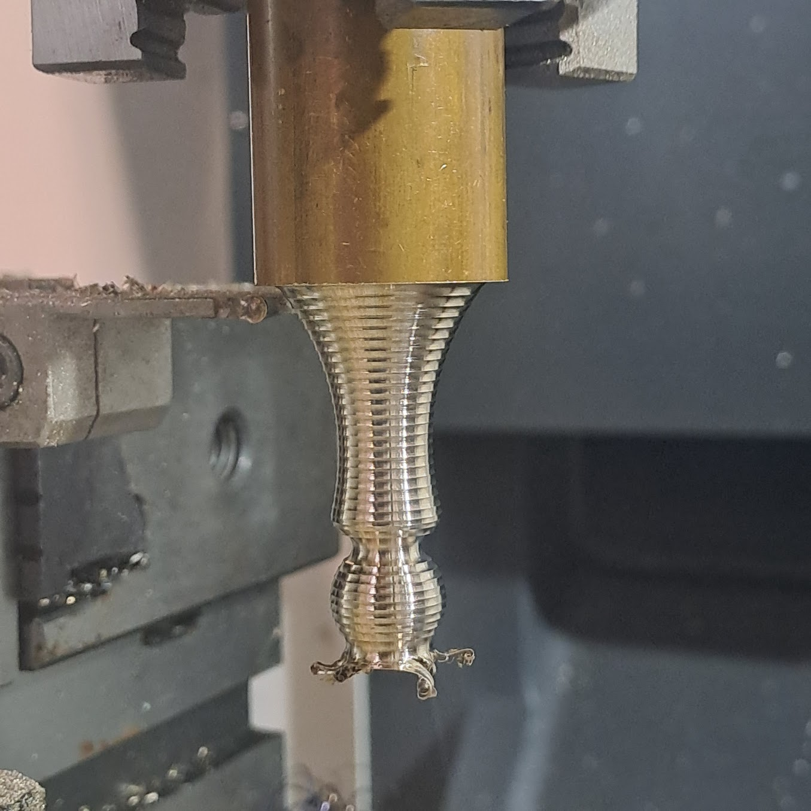
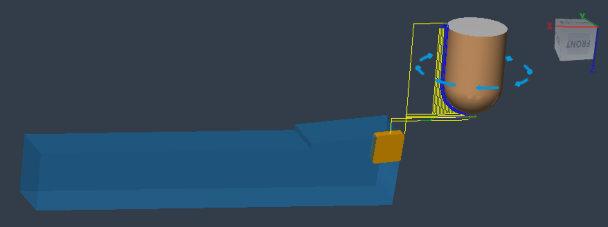
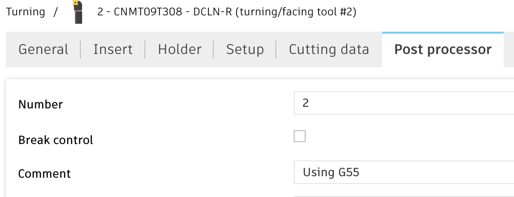
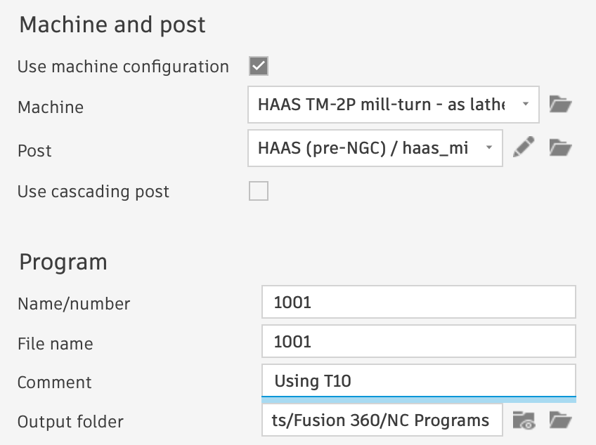

# Customised Fusion 360 postprocessors

## Turning on a HAAS VMC mill
This repo contains a modification of the standard Haas mill post-processor.
It allows turning parts chucked up in the spindle, with turning tools mounted to the table.

### Features
#### Supported
- turning/facing/parting etc via linear and arc moves

#### Needs testing
- [] ID turning/boring
- [] center drilling

#### To be added
- [] external single-point threading
- [] internal single-point threading
- [] internal tapping (?)

#### Not supported
- constant surface speed

### General offset considerations
With the part chucked up in a tool holder and tools fixed to the table, we need to set up _work offsets_ corresponding to each tool.
At the same time, the _tool offsets_ will correspond to different parts to be machined.

### Part design
Design a part as usual, with "chuck" in the -Z direction, and part protruding in the +Z direction

### CAM set-up

For working on toolpaths in the "Manufacturing" workbench, I recommend orienting the view upside down (+Z pointing down, +X pointing left).
This way the view will correspond to looking at the machine from the front.

### Tools

Each turning tool can have the corresponding _offset_ (G54/G55/...) specified in the "Comment". Default is G54.

### Tool number used for workholding

The generated program does not include an explicit tool change command. However, the tool offset is set from the tool offset table,
and as a precaution the postprocessor requires tool number to be set in the program comment - e.g. `T10`.

# Postprocessor change details
- enable [CAPABILITY_TURNING](https://github.com/ig248/fusion360/commit/958b509f2496e562853f08356eb5f7cf07d5966f#diff-e22d2b0b6a233a61771d4c87417e544562ef05dd2084ba6c2d962079acb0e6bcR26)
- change default plane from XY to [XZ](https://github.com/ig248/fusion360/commit/958b509f2496e562853f08356eb5f7cf07d5966f#diff-e22d2b0b6a233a61771d4c87417e544562ef05dd2084ba6c2d962079acb0e6bcR26) - NB: clockwise/anti-clockwise (G02/G03) directions remain correct!
- extract global tool offset index from [program comment](https://github.com/ig248/fusion360/commit/958b509f2496e562853f08356eb5f7cf07d5966f#diff-e22d2b0b6a233a61771d4c87417e544562ef05dd2084ba6c2d962079acb0e6bcR26)
- set _work offset_ (from tool comment) instead of _tool offset_ on [tool change](https://github.com/ig248/fusion360/commit/958b509f2496e562853f08356eb5f7cf07d5966f#diff-e22d2b0b6a233a61771d4c87417e544562ef05dd2084ba6c2d962079acb0e6bcR26)
- [convert feed](https://github.com/ig248/fusion360/commit/958b509f2496e562853f08356eb5f7cf07d5966f#diff-e22d2b0b6a233a61771d4c87417e544562ef05dd2084ba6c2d962079acb0e6bcR26) from mm/rev to mm/min

# Links
- https://cam.autodesk.com/posts/posts/guides/Post%20Processor%20Training%20Guide.pdf
- https://academy.titansofcnc.com/files/Fundamentals_of_CNC_Machining.pdf
